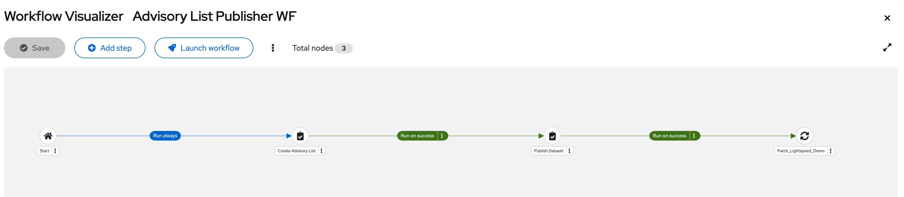
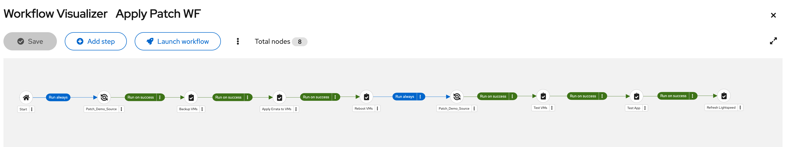
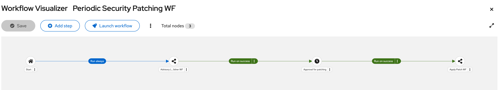

# patching-rhel-lightspeed-demo
This repo includes ansible playbooks for a demo project of automating periodic patching process for RHEL with Red Hat Lightspeed and Red Hat Ansible Automation Platform.

## Automating patcing process for RHEL with Red Hat Lightspeed and Red Hat Ansible Automation Platform
The goal behind the code is to demonstrate a simple example for automating patcing process with Red Hat Lightspee as a vulnerability management and with Red Hat Asible Automation Platform as an automation orchestrator.

## Assumed demo environment
The assumed environment can be set up on AWS EC2 easily by using playbooks and roles in the [setup](./setup) folder. Please refer to [SETUP.md](./setup/SETUP.md) for more details.

## Included contents
### Playbooks
|Name     |Description|
|:--------|:----------|
|`create_advisory_list.yml`|Create an applicable security advisory list from Red Hat Lightspeed.|
|`publish_dataset.yml`|Push the advisory list to a Git Repo.|
|`backup_vm.yml`|Snapshot the disk of runnning managed VMs.|
|`apply_errata.yml`|Apply all security advisories in the advisory list.|
|`reboot_vm.yml`|Reboot the running managed VMs.|
|`test_vm.yml`|Test the infrastructure of the resbooted VMs.|
|`test_app.yml`|Test the application of the rebooted VMs.|
|`refresh_lightspeed.yml`|Upload the refreshed system status to Red Hat Lightspeed.|

### Group variables
These variables have already been set as follows. You can adjust them based on your environment.
```
---
purpose: patch_demo

aws_region: ap-northeast-1 # adjust with your preference
wp_weblog_title: "DemoSite"

# Location of remediation_dataset downloaded.
remediation_dataset_file: "{{ playbook_dir }}/datasets/remediation_dataset.yml"

remediation_group: canonical_remediation_targets
```

## Prerequisite

### Prepare a deploy key to your GitHub repo
You need to set up a deploy key to gives workflows running on AAP safe access to just one single repository. 

Generate a dedicated key pair:
```
$ ssh-keygen -t ed25519 \
    -C "aap-publish-dataset" \
    -f aap_publish_dataset
```

Please refer to [Deploy keys](https://docs.github.com/en/authentication/connecting-to-github-with-ssh/managing-deploy-keys#deploy-keys) for more details.

## Installation and usage
Assuming the demo environement has been already created by the way of before mentioned and you've also performed `git clone` this repo. Ensure that you are logged in to your Ansible Automation Controller before proceeding with following steps.

### Create credentials
At leaset the following four credentails need to be defined. 

#### Credential for AWS
1. Click `Credentials` in the left menu.
2. Click `Create credential` button.
3. Enter the following fields:
   - Name: `aws_cred`
   - Organization: `Default`
   - Credential Type: `Amazon Web Services`
   - Access Key: your AWS_ACCESS_KEY_ID
   - Secret Key: your AWS_SECRET_ACCESS_KEY
4. Click `Create credential` button.

#### Credential for ssh to AWS instances
1. Click `Credentials` in the left menu.
2. Click `Create credential` button.
3. Enter the following fields:
   - Name: `aws_key`
   - Organization: `Default`
   - Credential Type: `Machine`
   - SSH Private Key: your AWS private key
   - Username: `ec2-user`
4. Click `Create credential` button.

#### Credential for pusing to Git repo
1. Click `Credentials` in the left menu.
2. Click `Create credential` button.
3. Enter the following fields:
   - Name: `GitHub Push Credential`
   - Organization: `Default`
   - Credential Type: `Machine`
   - Git SSH Private Key: your Git private key
4. Click `Create credential` button.


### Create inventories
1. Click `Inventories` in the left menu.
2. Click `Create inventory` button and select `Create inventory`.
3. Enter the following fields:
   - Name: `Patch_Demo`
   - Organization: `Default`
4. Click `Create inventory` button and then select `Sources` tab.
5. Click `Create source` button.
6. Enter the following fields:
   - Name: `Patch_Demo_Source`
   - Source: `Amazon EC2`
   - Credential: `aws_cred`
   - Update options: `Overwrite`, `Overwrite variables`
   - Source variables:
   ```
   ---
   # Minimal example using environment variables
   # Fetch all hosts in ap-northeast
   plugin: amazon.aws.aws_ec2
   keyed_groups:
   - prefix: tag
      key: tags

   # Change regions corresponding to your environment
   regions:
   - ap-northeast-1 # adjust with your preference

   # Filter only objects taged with "purpose" tag as "patch_demo"
   filters:
   tag:purpose: patch_demo

   hostnames:
   - private-dns-name

   compose:
   ansible_host: public_dns_name

   # Ignores 403 errors rather than failing
   strict_permissions: false
   ```
7. Click `Create source` button.


### Create a project
1. Click `Projects` in the left menu.
2. Click `Add` button.
3. Enter the following fields:
   - Name: `Patch_Lightspeed_Demo`
   - Organization: `Default` (or your prefered organization)
   - Execution Environment: `Default execution environment`
   - Source Control Type: `Git`
   - Source Control URL: your Git repositoriy
   - Options: `Clean`
4. Click `Create project` button

Please refer to [Ansible Doc](https://docs.redhat.com/en/documentation/red_hat_ansible_automation_platform/2.7/develop-proc_controller_adding_a_project) for more details.


### Create job templates
Each job template is equivalent to a playbook in this repository. Repeat these steps for each template/playbook that you want to use and change the variables specific to the individual playbook. Please refer to [Ansible Doc](https://docs.redhat.com/en/documentation/red_hat_ansible_automation_platform/2.7/develop-proc_controller_create_job_template) for more details.

1. Click `Templates` in the left menu.
2. Click `Create template` button and select `Create job template`.
3. Follow the next steps respectively.
4. Click `Create job template` button

#### Create Advisory List
- Name: `Create Advisory List`
- Job Type: `Run`
- Inventory: `Patch_Demo`
- Project:  `Patch_Lightspeed_Demo`
- Playbook: `create_advisory_list.yml`
- Credentials: `Lightspeed_cred`

#### Publish Dataset
- Name: `Publish Dataset`
- Job Type: `Run`
- Inventory: `Patch_Demo`
- Project:  `Patch_Lightspeed_Demo`
- Playbook: `publish_dataset.yml`
- Credentials: `Git_SSH_key`
- Variables:
  ```
  ---
  git_repository_url: git@github.com:yourname/your-git-repository.git
  ```

#### Backup VMs
- Name: `Backup VMs`
- Job Type: `Run`
- Inventory: `Patch_Demo`
- Project:  `Patch_Lightspeed_Demo`
- Playbook: `backup_vm.yml`
- Credentials: `aws_cred`

#### Apply Errata to VMs
- Name: `Apply Errata to VMs`
- Job Type: `Run`
- Inventory: `Patch_Demo`
- Project:  `Patch_Lightspeed_Demo`
- Playbook: `apply_errata.yml`
- Credentials: `aws_key`

#### Reboot VMs
- Name: `Reboot VMs`
- Job Type: `Run`
- Inventory: `Patch_Demo`
- Project:  `Patch_Lightspeed_Demo`
- Playbook: `reboot_vm.yml`
- Credentials: `aws_key`

#### Test VMs
- Name: `Test VMs`
- Job Type: `Run`
- Inventory: `Patch_Demo`
- Project:  `Patch_Lightspeed_Demo`
- Playbook: `test_vm.yml`
- Credentials: `aws_key`

#### Test App
- Name: `Test App`
- Job Type: `Run`
- Inventory: `Patch_Demo`
- Project:  `Patch_Lightspeed_Demo`
- Playbook: `test_app.yml`
- Credentials: `aws_cred`

#### Refresh Lightspeed
- Name: `Refresh Lightspeed`
- Job Type: `Run`
- Inventory: `Patch_Demo`
- Project:  `Patch_Lightspeed_Demo`
- Playbook: `refresh_lightspeed.yml`
- Credentials: `aws_key`


### Create workflow templates
Above job templates are acutually configured as separate workflow templates. Follow the next steps for workflow templates. Please refer to [Ansible Doc](https://docs.redhat.com/en/documentation/red_hat_ansible_automation_platform/2.7/develop-proc_controller_create_workflow_template) for more details.

#### Advisory List Publisher WF

1. Click `Templates` in the left menu.
2. Click `Create template` button and select `Create workflow job template`.
3. Click `Create workflow job template` button.
4. Click `Add step` in the launched Visualizer.
5. Configure the workflow template as follows:


1. Click `Save` button.

#### Apply Patch WF

1. Click `Templates` in the left menu.
2. Click `Create template` button and select `Create workflow job template`.
3. Click `Create workflow job template` button.
4. Click `Add step` in the launched Visualizer.
5. Configure the workflow template as follows:


6. Click `Save` button.

#### Periodic Security Patching WF

1. Click `Templates` in the left menu.
2. Click `Create template` button and select `Create workflow job template`.
3. Click `Create workflow job template` button.
4. Click `Add step` in the launched Visualizer.
5. Configure the workflow template as follows:


6. Click `Save` button.
